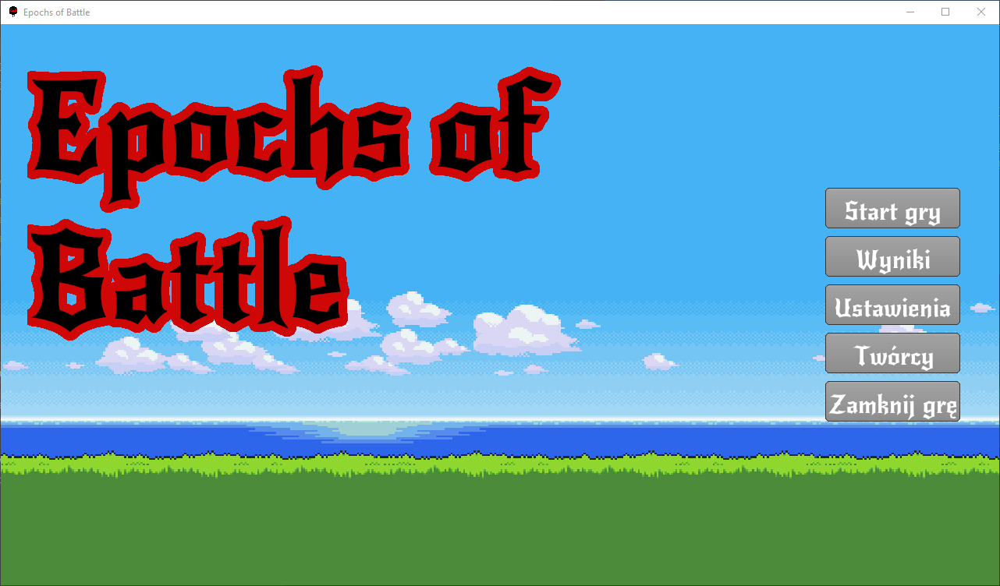
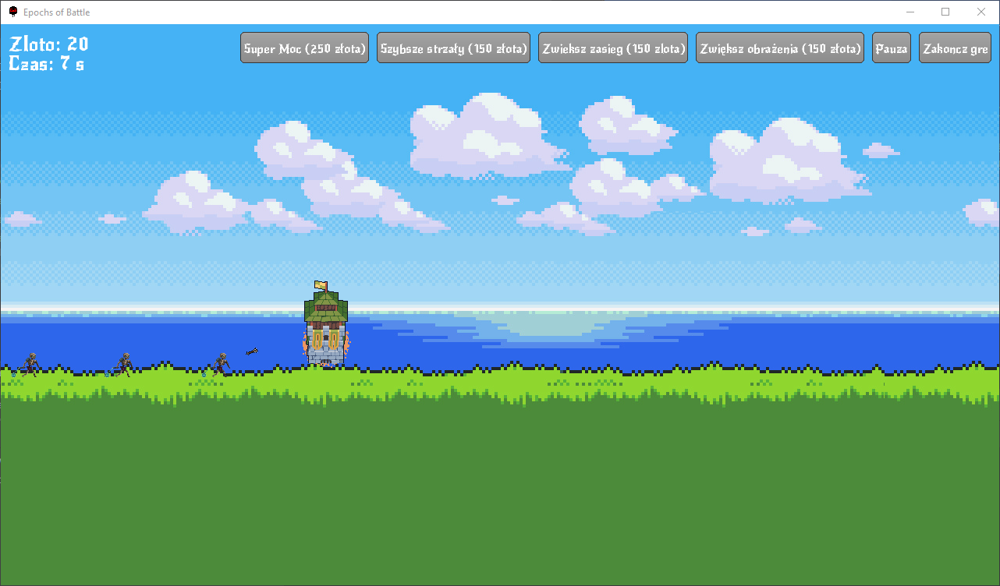
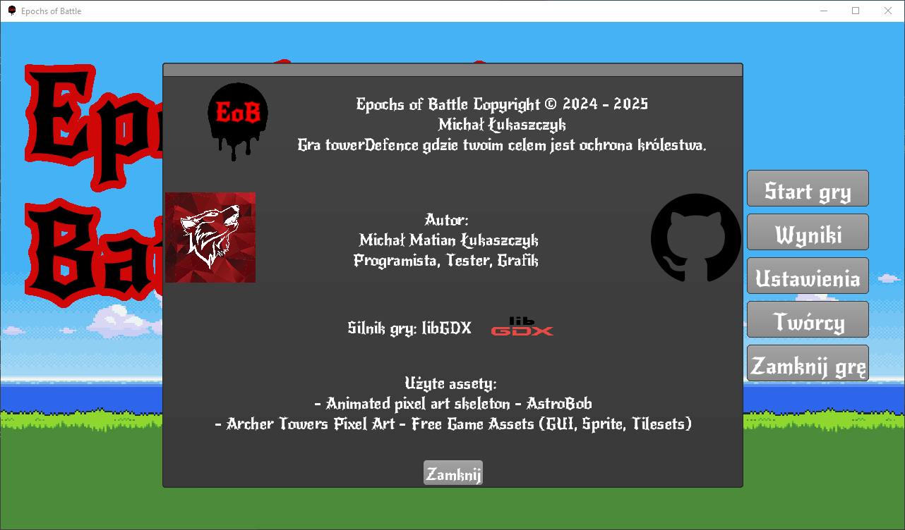

# 🏰 Epochs of Battle

**Epochs of Battle** is a 2D tower defense game created using the **libGDX** framework. You must protect your kingdom from incoming waves of enemies by strategically placing towers, upgrading their stats, and unleashing powerful magic attacks.

---

## 🎮 Gameplay

- Defend your territory against increasingly challenging waves of enemies.
- Earn gold from defeated enemies and use it to:
  - 🏹 Place new towers (100 gold each)
  - 🔥 Upgrade tower damage (150 gold)
  - 🏹 Increase tower range (150 gold)
  - ⚡ Improve tower shooting speed (150 gold)
- ☄️ Use a powerful wizard skill that rains arrows from the sky (250 gold).
- Survive as long as possible!


## 👤 Author

Michał Łukaszczyk

## 🖼️ Assets Used

- *Animated Pixel Art Skeleton* by AstroBob  
- *Archer Towers Pixel Art* by Free Game Assets (GUI, Sprite, Tilesets)

## 🛠️ Built With

- [libGDX](https://libgdx.com/) – cross-platform game development framework


## 🚀 Running the Project

You can run this project easily using the Gradle wrapper.

### Requirements
- Java 8 or later
- Git

### Clone and run:
```bash
git clone https://github.com/your-username/epochs-of-battle.git
cd epochs-of-battle
./gradlew desktop:run
```

## 📦 Download

A ready-to-play `.jar` file is available in the [Releases section](https://github.com/matiqn18/epochs-of-battle/releases).  
Simply download the latest `.jar`, make sure you have Java installed, and run:

```bash
java -jar epochs-of-battle.jar
```

## 🖼️ Screenshots

Below are some in-game screenshots showing the interface, gameplay, and atmosphere of *Epochs of Battle*:


*Main menu with access to game, settings, and credits*


*Active tower defense gameplay – defending your kingdom from enemy waves*


*Credits window with information about the author, engine, and assets*

